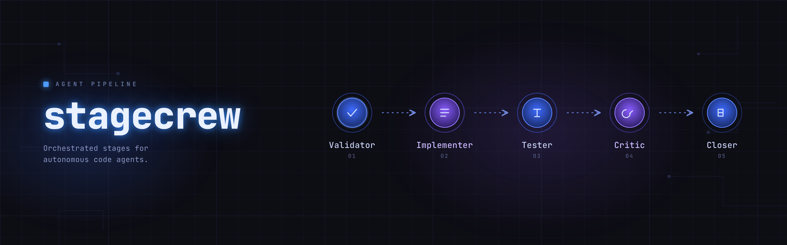

# stagecrew — spec-driven agentic coding loops for Claude Code



> **TL;DR** — `/init-agents` bootstraps your repo standards → `/create-issue` turns an idea into a fully-spec'd GitHub issue → `/plan-issues` derives the actionable work-list before the loops start (optional for a single issue) → `/work-issue` drives it through a fixed, auditable 5-stage pipeline that reviews the change and merges the PR in-loop. Standards live in your repo, not in this plugin.

An autonomous crew that specs, builds, tests, critiques, and ships a GitHub issue — without babysitting each step:

```
issue → Validator → Implementer → Tester → Critic → Closer → merged PR
```

Pure-reader: all standards live in your repo's `AGENTS.md`. The plugin reads them; it never overrides them.

## Why

Writing code with AI agents works best when every issue carries its own spec, every repo carries its own conventions, and every loop has a small, fixed set of stages that can be audited after the fact. This plugin gives you those three things — a way to bootstrap repo standards, a way to specify an issue, and a way to drive that issue through to merge — without baking any opinions into the plugin itself.

## How it works

One issue flows through a fixed, auditable five-stage crew — spec-driven, never one-shot:

```
issue → Validator → Implementer → Tester → Critic → Closer → merged PR
```

Each stage posts a `[stage:<name>]` comment on the issue as an audit log, then hands off to the next. The Critic can send work back to the Implementer (bounded revise loop); the Closer opens the PR and merges it in-loop — squash-merge, issue close, remote-branch delete, deploy (semantics: `skills/work-issue/SKILL.md`, "Closer merge behavior").

## Status

Alpha — in active development. The current version lives in `.claude-plugin/plugin.json`; the per-bump policy (patch / minor / major) is documented in `AGENTS.md` under `version_policy`. Under `0.x` a minor bump may introduce breaking changes.

Development happens in a private repository; this public repo receives one commit per release. Issue and PR numbers cited in `docs/`, `CLAUDE.md` and the skills refer to that private tracker. Bug reports and proposals are welcome here — see [CONTRIBUTING.md](CONTRIBUTING.md).

## Install

```
claude plugin marketplace add https://github.com/Domek-Labs/stagecrew-oss
claude plugin install stagecrew
```

After install, restart Claude so the plugin cache picks up the new skills.

## Skills

- `/init-agents` — bootstrap `AGENTS.md` per repo (one-time)
- `/create-issue` — idea → fully-specified GitHub issue
- `/plan-issues` — open issues → actionable work-list, `area:`/`bundle:` labels and a start-time collision report (optional, recommended once several issues are in flight)
- `/work-issue` — issue → reviewed, merged PR via Validator → Implementer → Tester → Critic → Closer (the Closer merges in-loop)
- `/loop` — umbrella router for the pipeline skills above
- `github` — reference for git/gh interaction conventions (commit identity, no unconfigured co-authors, PR body, squash-merge caveat)

See `CLAUDE.md` for the quickstart.

## Parallel-safe `/work-issue`

`/work-issue` is **parallel-safe**: concurrent runs on one repo each claim their issue (assignee + `claimed:<agent-id>` label + claim comment; a stale claim is reclaimed, and among active claims the earliest wins — the staleness rule, `claim_stale_minutes` and evaluation order are canonical in `skills/work-issue/SKILL.md`, "Claim protocol") and work in an **isolated git worktree** rather than the shared checkout. A claim is released on any failure exit so the issue returns to the pool, and on the one Closer exit that leaves the PR open (`ESCALATE: CI pending`), where the open PR itself is the duplicate-work guard: a pre-flight open-PR check routes a re-run to the Closer merge steps — there only for a single matching PR that carries a Critic `APPROVE` and a Closer terminal comment naming it, so the loop never merges a PR it did not review. On the successful `merged` verdict the claim is instead **retired** rather than released — canonical in `skills/work-issue/SKILL.md`, "Closer merge behavior" → "Claim retirement on success". There is no controller and no merge-queue yet.

## Optional component registry

Repos with real component patterns (a frontend framework, a backend domain layer, or both) can opt into a canonical component registry via a `components:` block in AGENTS.md. When set, the loop enforces reuse across sessions: Validator gates in-scope issues, Implementer refuses inline duplicates, Critic scans for dupes. `usage_policy` picks the enforcement level (`prefer_existing` warns, `strict` STOPs and requires an ADR link). Absent block = zero behavior change. See `AGENTS.md` under "Component Registry" and `docs/adr/0001-components-registry.md` for the design.

## Commit attribution

AGENTS.md carries an optional `commit_identity` field (`name` + `email`) in the `work-issue:` namespace. It fixes the author identity used for every loop commit, so attribution never depends on ambient `git config` or assistant memory, and it pairs with the `no_unconfigured_coauthors` hard-gate. Absent field = zero behavior change.

The conventions themselves — what the stages do with the field, the co-author rule and the squash-merge caveat — are canonical in the `github` skill and restated nowhere else in this repo except the one declared copy in `skills/init-agents/references/AGENTS.md.template`. Stages that receive a rendered brief get them by transclusion at dispatch time. See `skills/github/SKILL.md`.

## Loop types

The plugin supports two issue types via the `loop-type:<type>` label:

- **`loop-type:code`** — software-implementation loops (default). Template: `skills/create-issue/references/issue-templates/code.md`.
- **`loop-type:research`** — research / findings loops (knowledge generation, test-matrix studies, library comparisons). Template: `skills/create-issue/references/issue-templates/research.md`.

Use `/create-issue --type=<code|research> "<idea>"` to pick one explicitly, or let auto-inference handle it.

## Recommended companion MCPs (optional)

The plugin runs standalone — none of the skills require an external MCP server. But two MIT-licensed MCPs make the loop noticeably richer if they're wired into your Claude Code session. Both are opportunistically called: when the tool namespace is missing, the skills fall back to plain `grep` / `ls` / no-op.

- **[codebase-memory-mcp](https://github.com/DeusData/codebase-memory-mcp)** — local code-graph MCP. Parses your repo with tree-sitter, exposes `list_projects`, `index_repository`, `index_status`, `search_code`, `get_architecture`, `detect_changes`, and more. `/init-agents` uses it to suggest architecture / conventions defaults, `/create-issue` uses it for files-to-touch suggestions plus hotspot warnings, and `/work-issue` calls it from the Validator, Implementer, and Critic stages for code-graph-backed evidence.

- **[MemPalace](https://github.com/MemPalace/mempalace)** — verbatim knowledge-store MCP. The `/work-issue` Closer stage can persist a loop summary (repo, PR, commit, Tester findings) as a "drawer" so future sessions can search for prior decisions. The Closer's persistence step is a no-op when MemPalace is not installed.

Neither is required. Install what you like, skip what you do not.

## Adapting to other workflows

Right now this plugin is built specifically around **GitHub issues**: an issue is the unit of work, the `gh` CLI is the interface, and a loop ends in a merged pull request. That coupling is a convention, not a hard requirement.

The underlying primitives — a per-issue spec standard, a per-repo `AGENTS.md`, and a small fixed set of audited stages — are tracker-agnostic. If your work lives somewhere else (Linear, Jira, a plain Markdown task file, an internal queue), you can rewrite the thin GitHub layer in the skills to read and write your own source of truth instead. The pipeline shape stays the same; only the issue/PR I/O changes.

PRs that generalize this layer are welcome.

## License

MIT — see [LICENSE](LICENSE).

## Optional visual reviewer gate

Repos with a frontend can opt into a **Visual Reviewer** stage via a `visual:` block in AGENTS.md. When set, `/work-issue` serves the built frontend and inspects it with Playwright (per route × viewport, mobile first) between the Tester and the Critic — screenshots, a11y snapshots and console checks — and posts a `[stage:visual] PASS|FAIL` verdict with the screenshots attached. A FAIL routes back to the Implementer. It is a gate, not a new loop-type: frontend work keeps the `code` pipeline and layers the visual check on top (same axis as `components:`). Needs the optional Playwright MCP; absent → the stage is skipped cleanly. Absent block = zero behavior change. See `AGENTS.md` under "Visual Reviewer Gate" and `docs/adr/0002-visual-gate.md`.
